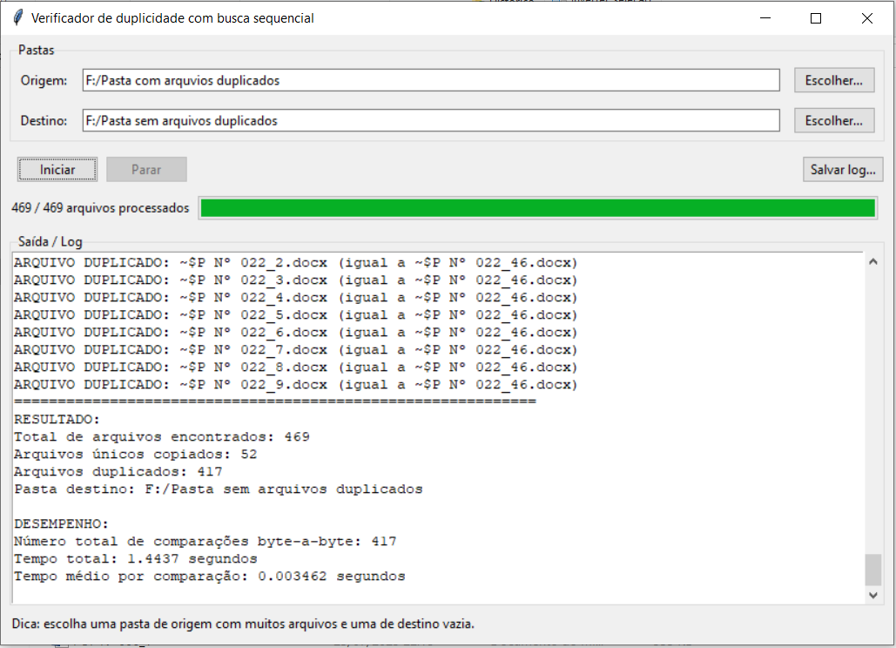
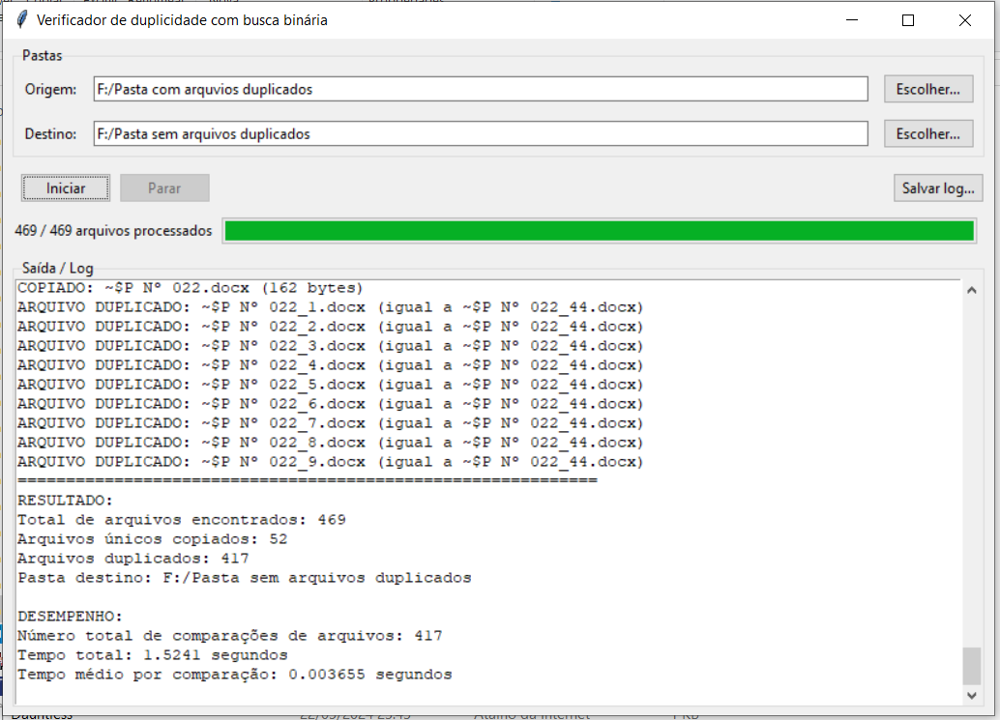
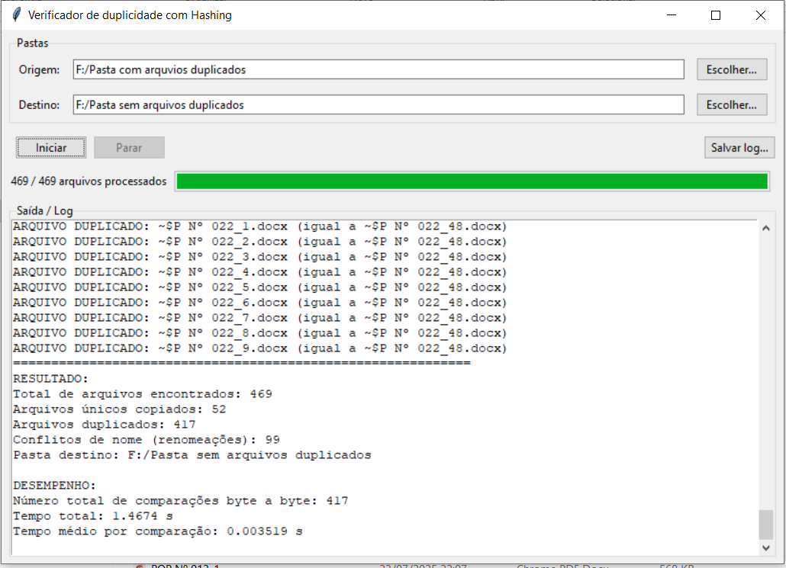
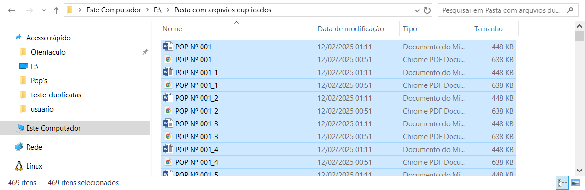
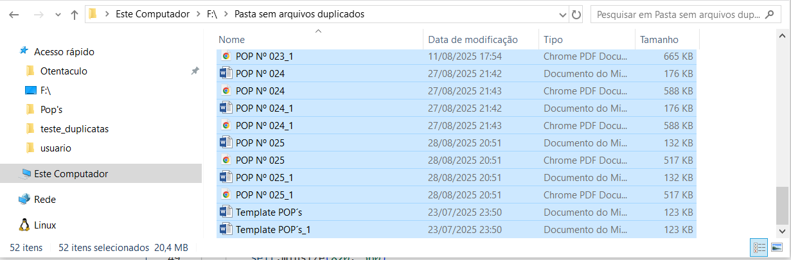

## Alunos  
| Matrícula | Nome |  
|-----------------------|---------------------|  
| 20/0025058 | Mayara Alves de Oliveira |  
| 20/2016720 | Luana Ribeiro Soares     |  

## Descrição do projeto
O projeto tem como objetivo **evitar o armazenamento de arquivos duplicados** em um diretório de destino.  
Essa verificação é fundamental porque duplicatas:  
- Consomem espaço de forma desnecessária;  
- Podem causar confusão na organização;  
- Prejudicam a eficiência do sistema.  

A lógica central funciona assim:  
1. O sistema analisa o **tamanho do arquivo**.  
2. Caso exista outro arquivo com o mesmo tamanho, é feita uma **comparação de conteúdo** byte a byte.  
3. - Se forem idênticos → o novo arquivo é descartado e o usuário é informado.  
   - Se forem diferentes → o arquivo é considerado único e armazenado.  

Dessa forma, apenas arquivos realmente únicos permanecem no diretório de destino.  

### Métodos de Verificação  

#### Hashing com Lista Encadeada ([HASH.py](HASH.py))  
- O **tamanho do arquivo** é usado como chave em uma **tabela hash**.  
- Se não houver conflito, o arquivo é registrado diretamente.  
- Em caso de conflito (mesmo tamanho já registrado), ocorre a comparação de conteúdo:  
  - **Arquivos iguais** → o novo é descartado.  
  - **Arquivos diferentes** → o endereço é adicionado à lista encadeada na tabela hash.  

#### Busca Sequencial ([SEQUENCIAL.py](SEQUENCIAL.py))  
- Mantém uma **lista simples** de arquivos já processados.  
- Cada novo arquivo é comparado **um a um** com os anteriores.  

#### Busca Binária por Tamanho ([BINARIA.py](BINARIA.py))  
- Utiliza uma **árvore binária de busca (BST)**, onde cada nó representa um tamanho de arquivo.  
- Arquivos são inseridos de acordo com seu tamanho.  
- A busca por tamanhos iguais é mais rápida que na lista sequencial, pois a árvore permite **descartar partes irrelevantes**.  

## Guia de instalação

### Dependências do projeto

- [Python 3.x](https://www.python.org/downloads/)  
- [Tkinter](https://docs.python.org/3/library/tkinter.html) (para interface gráfica)  

### Como executar o projeto

Execute qualquer um dos arquivos `.py` para abrir a interface gráfica correspondente ao método de busca desejado:

```sh
python SEQUENCIAL.py
python BINARIA.py
python HASH.py
```
## Capturas de tela
- **Busca Sequencial**  
    

- **Busca Binária**  
    

- **Hashing**  
    

- **Pasta de Origem**  
      

- **Pasta de Destino**     
     
    

## Conclusões

O sistema foi desenvolvido para garantir a integridade e evitar duplicidade nos arquivos armazenados.  
- Para cenários pequenos, a **busca sequencial** já atende.  
- Para cenários médios, a **busca binária** é um bom equilíbrio.  
- Para grandes volumes de dados, a **tabela hash** é a solução mais adequada.  

## Gravação 


<iframe width="560" height="315" src="https://www.youtube.com/embed/SvSuG8IaGgk?si=965s3V5MLBiXHkH6" title="YouTube video player" frameborder="0" allow="accelerometer; autoplay; clipboard-write; encrypted-media; gyroscope; picture-in-picture; web-share" referrerpolicy="strict-origin-when-cross-origin" allowfullscreen></iframe>


| Método        | Estrutura usada | Vantagem | Desvantagem |
|---------------|----------------|----------|-------------|
| **Sequencial** | Lista simples  | Fácil implementação | Muito lento em grandes volumes |
| **Binária (BST)** | Árvore de busca | Mais rápida que a lista sequencial | Pode ficar pesado em conjuntos muito grandes |
| **Hashing** | Tabela hash + lista encadeada | Muito eficiente em grandes volumes | Implementação mais complexa |


